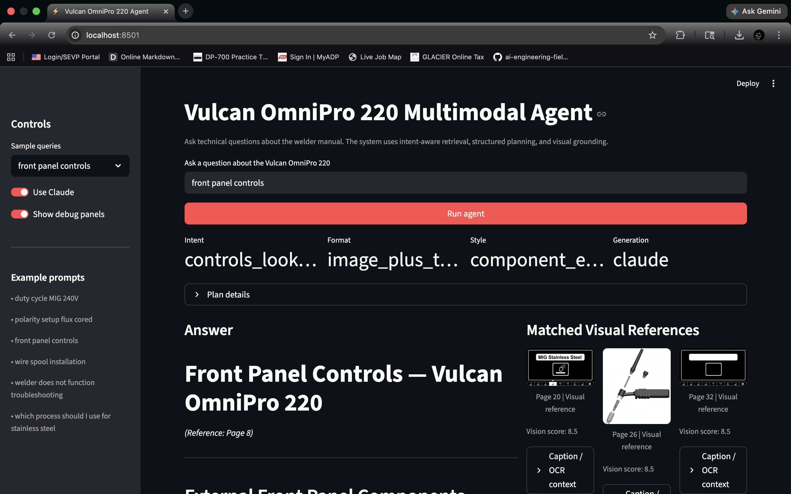
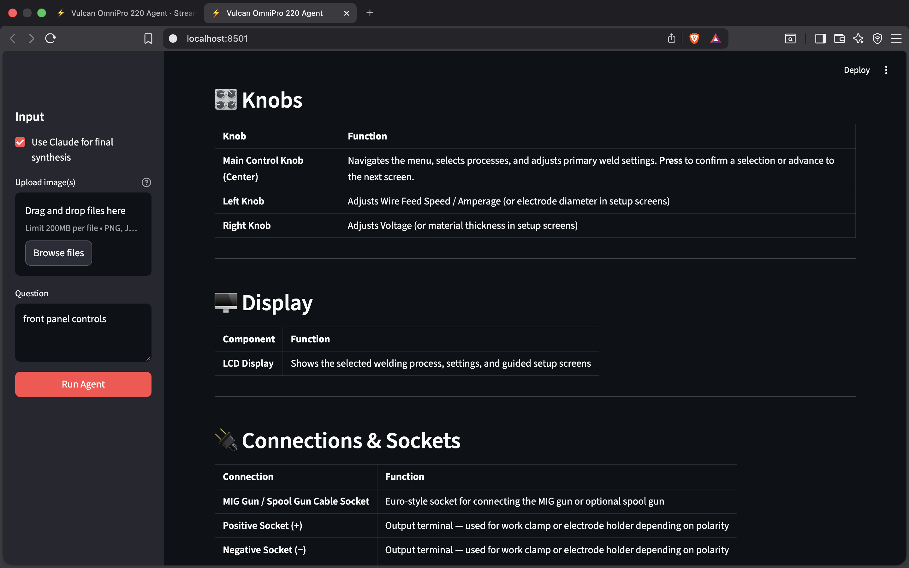
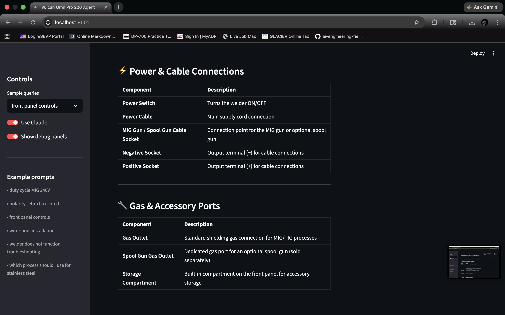
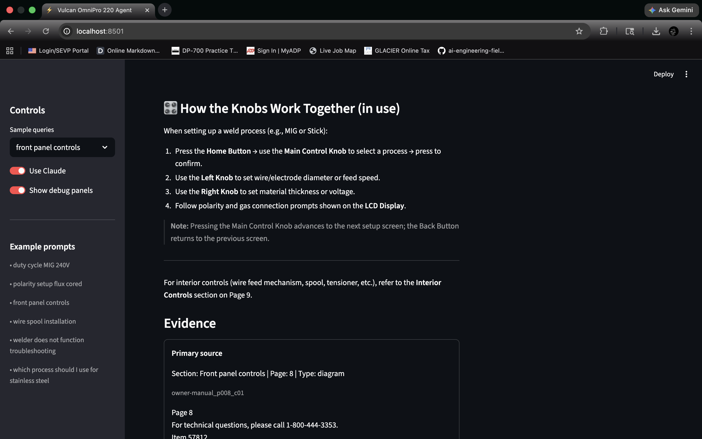
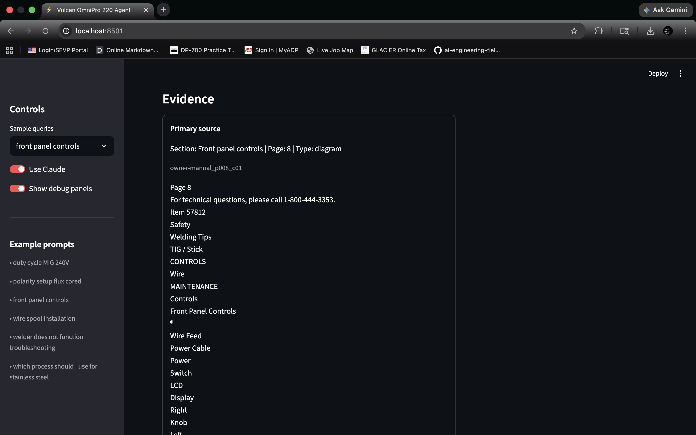
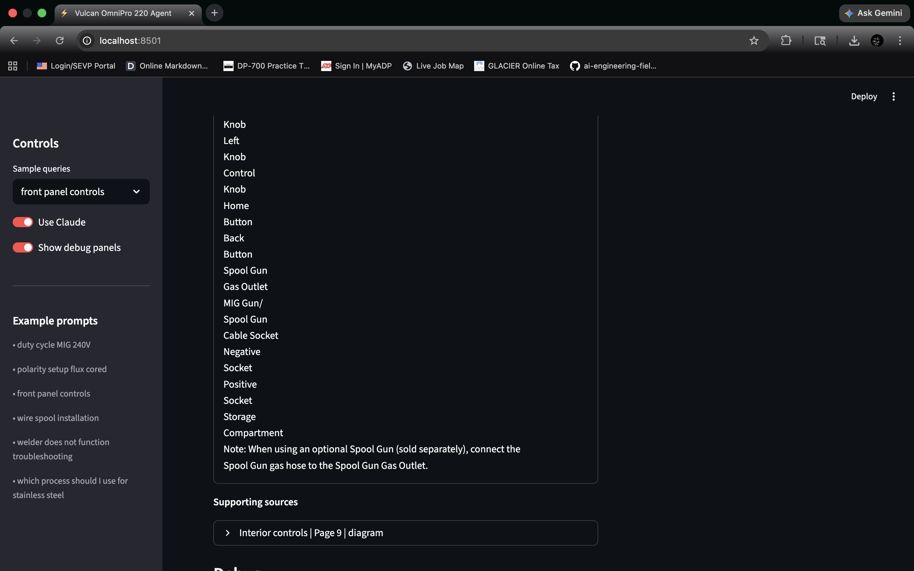
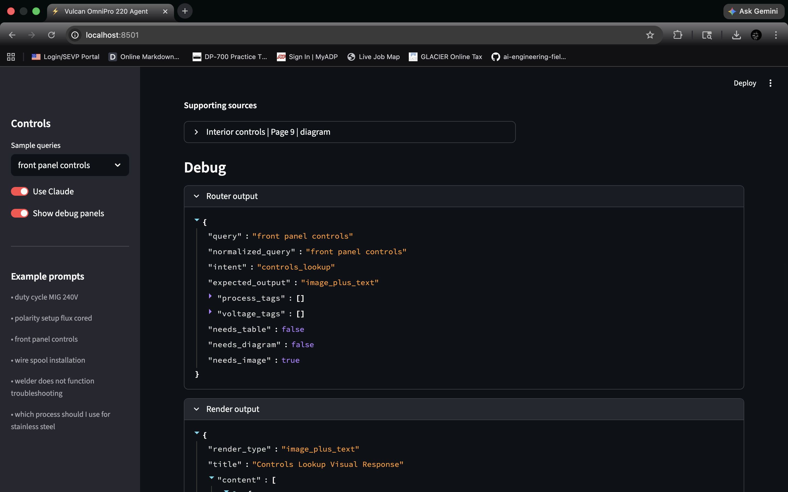
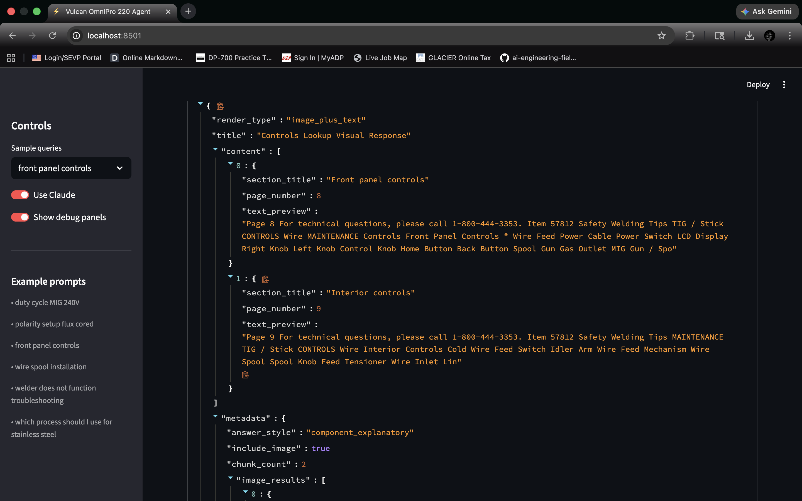
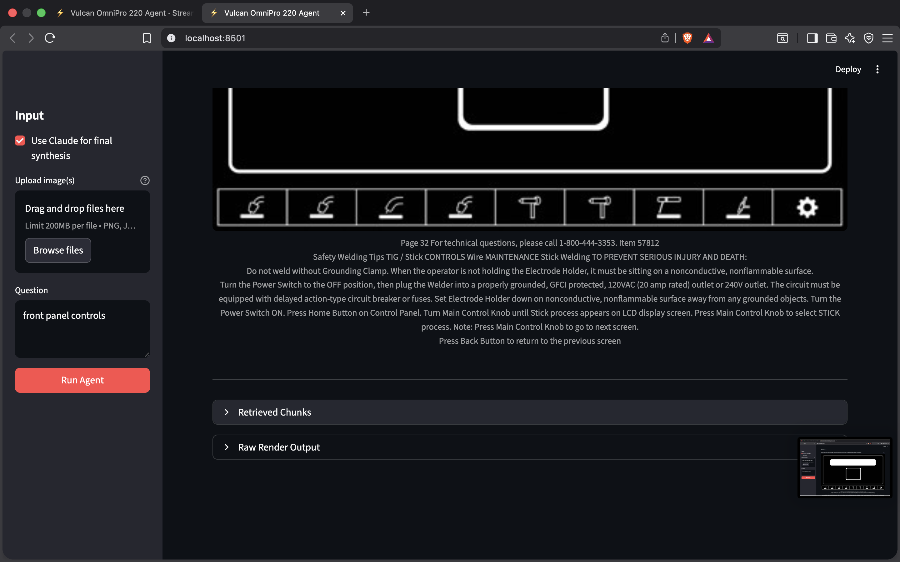

<!--# Prox Founding Engineer Challenge

 

## The Product

The [Vulcan OmniPro 220](https://www.harborfreight.com/omnipro-220-industrial-multiprocess-welder-with-120240v-input-57812.html) is a multiprocess welding system sold by Harbor Freight. It supports four welding processes (MIG, Flux-Cored, TIG, and Stick), runs on both 120V and 240V input, and has an LCD-based synergic control system.

Its owner's manual is 48 pages of dense technical content. Duty cycle matrices across multiple voltages and amperages, polarity setup procedures that differ per welding process, wire feed mechanisms with specific tensioner calibrations, wiring schematics, troubleshooting matrices, weld diagnosis diagrams, and a full parts list.

This is exactly the kind of product Prox exists for. Nobody knows how to use this machine straight out of the box but has time to read 48 page manual, but a complicated machine needs expert-level support.

Additional video: https://www.youtube.com/watch?v=kxGDoGcnhBw

## Your Job

Build a multimodal reasoning agent for the Vulcan OmniPro 220 using the Claude Agent SDK. The agent must be able to answer deep technical questions about this product accurately, helpfully, and not just in text.

The manuals are in the `files/` directory.

**There is no limit to how far you can go.** You can integrate voice. You can build a full interactive experience. Sky is the limit. The more ambitious and polished, the better.

## What We're Testing

### 1. Deep Technical Accuracy

Your agent needs to answer questions like these correctly:

- "What's the duty cycle for MIG welding at 200A on 240V?"
- "I'm getting porosity in my flux-cored welds. What should I check?"
- "What polarity setup do I need for TIG welding? Which socket does the ground clamp go in?"

We will test with questions that require cross-referencing multiple manual sections, understanding visual content (diagrams, schematics, charts), and handling ambiguous questions that need clarification from the user.

### 2. Multimodal Responses

This is the most important part. Your agent must not be text-only.

- If someone asks about polarity setup, the agent should draw or show a diagram of which cable goes in which socket, not just describe it.
- If the answer relates to a specific image in the manual (the wire feed mechanism, the front panel controls, the weld diagnosis examples), the agent should surface that image.
- If a question is complex enough, the agent should generate interactive content: a duty cycle calculator, a troubleshooting flowchart, a settings configurator that takes process + material + thickness and outputs recommended wire speed and voltage.

When something is too cognitively hard to explain in words, the agent should draw it. Real-time diagrams, interactive schematics, visual walkthroughs generated through code.

For your agent to handle these responses well you need to reverse engineer Claude artifacts. Here are two places where you can start:
- https://claude.ai/artifacts (see how Claude renders interactive artifacts in chat)
- https://www.reidbarber.com/blog/reverse-engineering-claude-artifacts

### 3. Tone and Helpfulness

Imagine your user just bought this welder and is standing in their garage trying to set it up. They're not an idiot, but they're not a professional welder either.

### 4. Knowledge Extraction Quality

The manual has a mix of text, tables, labeled diagrams, schematics, and decision matrices. Some critical information exists only in images (the welding process selection chart, the weld diagnosis photos, the wiring schematic). We want to see that your agent understands and presents the visual content, not just the text.

## Tech Requirements

- Use the [Anthropic Claude Agent SDK](https://docs.anthropic.com) as the foundation for your agent.
- The project must run locally with a single API key provided via `.env`.
- You are responsible for your own API costs during development.

## How to Present Your Work

**This matters.** Your submission is not just the code — it's how you present it.

- **Build a frontend.** The best way for us to evaluate your agent is if it has a clean, simple UI we can run immediately. This is realistically the only way to properly demo an agent like this.
- **Hosting is a plus.** If you host it somewhere we can access without cloning, that's a strong signal. Not required, but it removes friction and shows initiative.
- **Write a clear README.** Explain how your agent works, what design decisions you made, how knowledge is extracted and represented, and how to run it. Your documentation will be evaluated — we want to see how you think and communicate, not just how you code.
- **Video walkthrough is a huge plus.** Record yourself demoing the agent and explaining your approach. Walk through the hard questions, show how it handles multimodal responses, explain your architecture. This gives us a much richer picture of your work than code alone.

We should be running your agent within 2 minutes of cloning your repo:

```bash
git clone <your-fork>
cd <your-fork>
cp .env.example .env   # we plug in our own Anthropic API key
# your install command (npm install, uv install, etc.)
# your run command (npm run dev, python app.py, etc.)
```

If it takes longer than that to set up, that's a problem.

## What to Submit

1. Fork this repo.
2. Build your solution.
3. Submit your fork URL through the form at [useprox.com/join/challenge](https://useprox.com/join/challenge).

## What Happens Next

We review submissions on a rolling basis and respond to every single one within a few days. Good luck.
-->

# ⚡ Vulcan OmniPro 220 Multimodal Reasoning Agent

[]()
[]()
[]()

A multimodal technical assistant for the **Vulcan OmniPro 220 welding system**.

This project transforms dense welding manuals into an **interactive AI agent** that can answer complex questions using:

This project transforms dense welding manuals into an interactive AI agent that can answer complex questions using:

-  Manual retrieval  
-  Image understanding  
-  Structured outputs (tables, diagrams)  
-  Reasoned answer synthesis  

---

##  Live Demo

 **Streamlit App**  
https://vulcanomnipro220agent.streamlit.app/

> **Note:**  
The deployed app currently shows degraded output because the Anthropic API key is not accessible in Streamlit Cloud.  
As a result, responses fall back to raw structured data instead of synthesized answers.  
Locally, with a valid API key, the system produces fully grounded and clean responses.

---

## What This Agent Does

Instead of behaving like a document search tool, this system:

-  Answers **specification queries** with tables  
-  Explains **setup and polarity** using diagrams  
-  Identifies **controls and components** using images  
-  Diagnoses **weld defects and issues**  
-  Supports **image + text reasoning**

---

## Key Features

### Multimodal Input
-  Text-only queries  
-  Image-only queries  
-  Combined text + image reasoning  

### Hybrid Retrieval
-  Keyword search (precision)
-  Semantic search (recall)

###  Figure Matching
-  Finds relevant diagrams and images from manuals

###  Intelligent Response Planning
Decides the best format:
-  Tables
-  Diagrams
-  Image-supported explanations
-  Step-by-step instructions

###  Structured Rendering
-  Polarity diagrams (ASCII)
-  Specification tables
-  Visual explanations

### Answer Synthesis
-  Produces **final answers**, not raw manual dumps

---

##  Architecture

### High-Level Pipeline

```text
User Query / Image
        ↓
Visual Analysis (Claude Vision)
        ↓
Hybrid Retrieval
  ├── Keyword Search
  └── Semantic Search
        ↓
Figure Matching
        ↓
Query Router
        ↓
Response Planner
        ↓
Renderer
  ├── Table
  ├── Diagram
  ├── Image
  └── Text
        ↓
Claude Answer Synthesis
        ↓
Final Answer
````

---

##  System Design

### 1. Ingestion Layer

*  Parses PDFs
*  Extracts text, images, tables
*  Creates structured datasets

### 2. Retrieval Layer

*  Hybrid search (keyword + vector)
*  Finds relevant manual chunks

### 3. Vision Layer

* Uses Claude to analyze uploaded images
* Extracts:

  * polarity setup
  * weld defects
  * control panels

### 4. Query Router

Determines:

*  Intent (specification, procedure, troubleshooting)
*  Output type (diagram, table, etc.)

###  5. Response Planner

Decides:

*  What content to use
*  How to present it

###  6. Renderers

Generate structured outputs:

*  Tables
*  Diagrams
*  Image-supported responses

###  7. Answer Synthesis

*  Claude converts structured output into final answers
*  Ensures clarity and correctness

---

##  Project Structure

```text
prox-challenge/
├── .git/
├── .gitignore
├── .env
├── README.md
├── requirements.txt
├── app/
│   ├── __init__.py
│   ├── config.py
│   ├── main.py
│   ├── schemas.py
│   ├── agent/
│   │   ├── __init__.py
│   │   ├── orchestrator.py
│   │   ├── prompts.py
│   │   ├── query_router.py
│   │   └── response_planner.py
│   ├── ingestion/
│   │   ├── __init__.py
│   │   ├── build_inventory.py
│   │   ├── chunk_manual.py
│   │   ├── extract_images.py
│   │   ├── extract_tables.py
│   │   └── parse_manual.py
│   ├── renderers/
│   │   ├── __init__.py
│   │   ├── diagram_renderer.py
│   │   ├── image_renderer.py
│   │   ├── table_renderer.py
│   │   └── text_renderer.py
│   ├── retrieval/
│   │   ├── __init__.py
│   │   ├── hybrid_search.py
│   │   ├── keyword_search.py
│   │   ├── metadata_filters.py
│   │   └── vector_store.py
│   └── vision/
│       ├── __init__.py
│       ├── figure_matcher.py
│       └── image_analysis.py
├── data/
│   ├── indexes/
│   │   ├── chunks.faiss
│   │   └── chunks_metadata.json
│   └── processed/
│       ├── chunks/
│       ├── images/
│       ├── images_manifest.json
│       ├── manual_inventory.json
│       ├── pages/
│       └── tables/
├── files/
├── notes/
├── proxy/
├── product-inside.webp
├── product.webp
├── result1.png
├── result2.png
├── result3.png
├── result4.png
├── result5.png
├── result6.png
├── result7.png
├── result8.png
└── result9.png
tests/
    ├── eval_questions.json
    └── smoke_test.py
```

---

##  Workflow

###  Example 1: Specification Query

**Input:**

```
duty cycle MIG 240V
```

**Flow:**

*  Routed to specification
*  Retrieves duty cycle tables
*  Returns structured table + explanation

---

### Example 2: Polarity Setup

**Input:**

```
polarity setup flux cored
```

**Output:**

*  Generated diagram
*  Step-by-step instructions
*  Grounded explanation


---

## Screenshots
Below are outputs in real-time:










## ⚙️ Setup Instructions

### 1. Clone Repo

```bash
git clone https://github.com/Gowtham-Pentela/prox-challenge.git
cd prox-challenge
```

---

### 2. Create Virtual Environment

```bash
python3 -m venv proxy
source proxy/bin/activate
```

---

### 3. Install Dependencies

```bash
pip install -r requirements.txt
```

---

### 4. Add API Key

Create `.env` file:

```bash
ANTHROPIC_API_KEY=your_api_key
```

---

### 5. Run Ingestion (if needed)

```bash
python -m app.ingestion.parse_manual
```

---

### 6. Run Locally

```bash
PYTHONPATH=. streamlit run app/main.py
```

---

## ☁️ Streamlit Deployment Notes

### Required

Add in Streamlit Secrets:

```toml
ANTHROPIC_API_KEY="your_key"
```

### Current Issue

Without API key:

* Claude synthesis fails
* App falls back to raw renderer output

---

## Example Queries

### Specifications

*  duty cycle MIG 240V
*  voltage range

### Setup

*  polarity setup flux cored
*  wire spool installation

### Controls

*  front panel controls

### Troubleshooting

*  welder not working
*  weld porosity causes

### Image Queries

*  Does this weld look correct?
*  What defect is this?

---

##  Limitations

*  Streamlit Cloud missing API key → degraded output
*  Figure matching still heuristic-based
*  Diagram rendering is ASCII (can be improved)

---

## Future Improvements

*  Stronger answer synthesis layer
*  Better figure ranking
*  Rich UI diagrams (SVG/interactive)
*  Evaluation framework
*  Improved multimodal reasoning

---

## Summary

This project demonstrates a **multimodal reasoning agent** that:

*  Understands both text and images
*  Retrieves relevant manual content
*  Decides the best way to present answers
*  Produces structured, grounded responses

It goes beyond simple RAG by combining:

-  Retrieval + Planning + Rendering + Reasoning

---

## 👤 Author

**Gowtham Pentela**

GitHub: [https://github.com/Gowtham-Pentela](https://github.com/Gowtham-Pentela)

---
